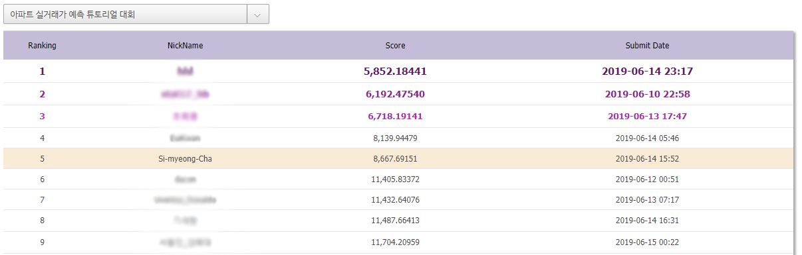

# dacon_apt_mission
 아파트 실거래가 예측

https://dacon.io/edu_missions/116748

1회 대회에서 아쉽게 실격처리가 되어 2번째 대회에 다시 도전하여 
총 18팀 중 5등을 하였습니다.

약 150만개의 데이터를 처음 다뤄보면서 컴퓨터의 한계에 부딪히기도 하였으며, colab을 이용하여 데이터 분석하는 방법을 배웠습니다.

국토부 실거래가 공공데이터를 통해 아파트 실거래 가를 예측하는 대회입니다.
